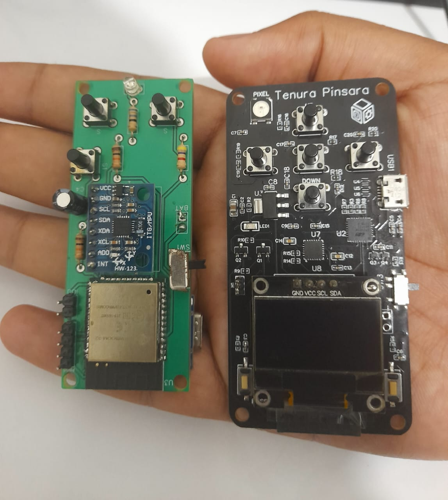

# 🖱️ AirSense: AI-Powered Air Mouse with TinyML

**AirSense** is a dual-mode smart controller that transforms an **ESP32 + MPU6050** into an intelligent **Bluetooth Air Mouse** and **Gesture-Based Media Controller**.

Unlike traditional air mice, AirSense uses **TinyML (Edge AI)** to process sensor data locally on the chip. It runs a custom Neural Network to recognize complex hand gestures—like raising your hand to increase volume—without needing cloud connectivity or Python scripts running on your PC.

---

##  Features

###  AI & TinyML
- **On-Device Inference:** Runs a Deep Neural Network (DNN) directly on the ESP32 (19ms latency).
- **Gesture Recognition:** Detects `Volume Up`, `Volume Down`, `Play/Pause`, and `Idle` states.
- **Spectral Analysis:** Uses FFT-based feature extraction for robust motion detection.
- **Privacy-First:** No sensor data is streamed to the cloud; all processing happens on the edge.

### 🖱️ Dual-Mode Operation
- **Mode 1: Air Mouse:** Precise cursor control using Gyroscope data.
- **Mode 2: Media Controller:** AI-based gesture recognition for intuitive media control.
    - ⬆️ **Hand Up:** Increase Volume
    - ⬇️ **Hand Down:** Decrease Volume
    - ⏯️ **Shake/Tap:** Play/Pause (Configurable)

### ⚙️ Standard Features
- ✅ **Scroll Up / Scroll Down** buttons
- ✅ **Left Mouse Click** button
- ✅ **RGB LED Indicators for Status & Inference Confidence**

---

## 🛠️ Hardware Requirements
- **ESP32** development board (ESP32-WROOM-32D recommended)
- **MPU6050** (Accelerometer + Gyroscope module)
- **Push Buttons** (for clicks and mode switching)
- **RGB LEDs** (Common cathode/anode with resistors)
- Jumper wires and breadboard

---

## 🔌 Pin Configuration

###  LEDs (Status & Debug)
| LED Color | GPIO Pin | Purpose |
|-----------|----------|--------------------------|
| Green | 15 | Bluetooth Connected / Inference Success |
| Red | 2 | Not Connected / Error |
| Blue | 4 | Button Press / Inference Processing |

###  Buttons
| Button | GPIO Pin | Function (Mouse Mode) | Function (Media Mode) |
|--------------|----------|------------------|-----------------------|
| UP Button | 36 | Scroll Up | Volume Up (Manual) |
| DOWN Button | 39 | Scroll Down | Volume Down (Manual) |
| LEFT Button | 34 | Left Click | Play/Pause |
| MODE Switch | 32 | **Toggle between Mouse & AI Mode** | -- |

###  MPU6050 Connection
| MPU6050 Pin | ESP32 Pin |
|-------------|-----------|
| SDA | 21 |
| SCL | 22 |
| VCC | 3.3V |
| GND | GND |

---

##  The AI Model (TinyML Details)
The gesture recognition is powered by a custom model trained using **Edge Impulse**:
* **Architecture:** Dense Neural Network (DNN) with Dropout.
* **Input:** 39 Spectral Features (derived from Accelerometer X/Y/Z).
* **Quantization:** Int8 (8-bit) for memory optimization (~15KB RAM usage).
* **Performance:** 94.9% Accuracy / 19ms Latency.

> *Note: The model is trained to ignore small, unintentional movements ("Idle" class) to prevent false positives.*

---

## 📸 Images

###  Schematic Diagram

---

## 🔧 Future Improvements
- [ ] **Custom ASIC Design:** Transition from ESP32 to a custom silicon design for ultra-low power (<500µW).
- [ ] **Sensor Fusion:** Integrate Magnetometer for drift correction.
- [ ] **On-Device Learning:** Allow users to record and train their own custom gestures directly on the mouse.

---

## 👨‍💻 Author
**Tenura Pinsara Pasandul**

---
