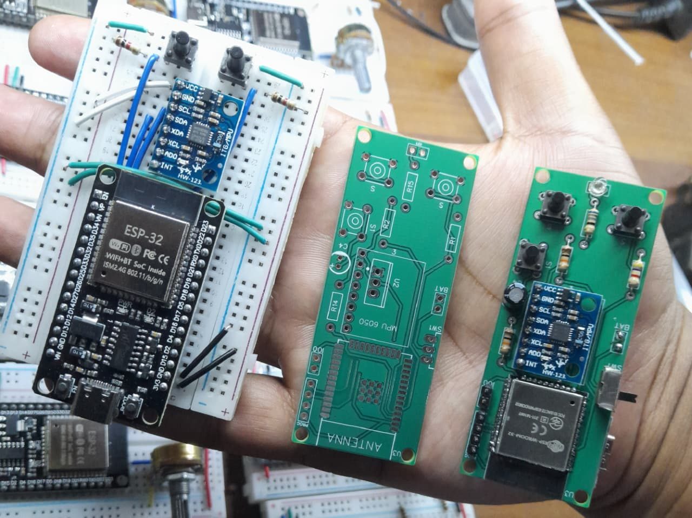

# 🖱️ ESP32 Air Mouse with MPU6050 and BLE

This project turns an **ESP32 + MPU6050** into a **Bluetooth Air Mouse**.  
The ESP32 uses **gyro data** from the MPU6050 to move the cursor, buttons to control **scrolling and clicks**, and RGB LEDs for **status indication**.

---

## 🚀 Features
- ✅ **Air Mouse Movement** using MPU6050 gyroscope  
- ✅ **Scroll Up / Scroll Down** buttons  
- ✅ **Left Mouse Click** button (Right click optional)  
- ✅ **RGB LED Indicators**:
  - 🔴 **Red LED** → Bluetooth not connected (blinks)  
  - 🟢 **Green LED** → Bluetooth connected (shows once for 2s)  
  - 🔵 **Blue LED** → Button pressed  

---

## 🛠️ Hardware Requirements
- **ESP32** development board  
- **MPU6050** (Accelerometer + Gyroscope module)  
- **Push Buttons** (for scroll and click)  
- **RGB LEDs** (Common cathode/anode with resistors)  
- Jumper wires and breadboard  

---

## 🔌 Pin Configuration

### 📍 LEDs
| LED Color | GPIO Pin | Purpose                  |
|-----------|----------|--------------------------|
| Green     | 15       | Connected status         |
| Red       | 2        | Not connected indicator  |
| Blue      | 4        | Button press indicator   |

### 📍 Buttons
| Button       | GPIO Pin | Function         |
|--------------|----------|------------------|
| UP Button    | 36       | Scroll up        |
| DOWN Button  | 39       | Scroll down      |
| LEFT Button  | 34       | Left click       |
| RIGHT Button | 32 (opt) | Right click      |

### 📍 MPU6050
| MPU6050 Pin | ESP32 Pin |
|-------------|-----------|
| SDA         | 21        |
| SCL         | 22        |

---

---

## ⚡ Installation & Setup

1. Install **Arduino IDE** (or PlatformIO).  
2. Install required libraries from Library Manager:
   - [BleMouse](https://github.com/T-vK/ESP32-BLE-Mouse)  
   - [Adafruit MPU6050](https://github.com/adafruit/Adafruit_MPU6050)  
   - [Adafruit Unified Sensor](https://github.com/adafruit/Adafruit_Sensor)  
3. Select **ESP32 Dev Module** as the board.  
4. Upload the code to ESP32.  
5. Pair ESP32 with your PC/Phone as a **Bluetooth mouse**.  

---

## 🎮 Usage
- Move the ESP32 board → Cursor moves on screen.  
- Press **UP button** → Scroll up.  
- Press **DOWN button** → Scroll down.  
- Press **LEFT button** → Left-click.  
- (Optional) Enable RIGHT button in code for right-click.  

---

## 📸 Images

### 🔧 Schematic Diagram  

---

## 🔧 Future Improvements
- Add **gesture support** (e.g., shake for right-click).  
- Add **acceleration-based scrolling**.  
- Improve **sensitivity calibration**.  

---

## 👨‍💻 Author
**Tenura Pinsara Pasandul**  

---

